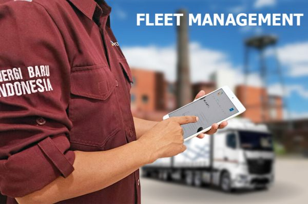

Apakah Anda mencari cara yang efisien dan hemat biaya untuk mengelola operasional armada Anda? Layanan manajemen energi dan manajemen armada kami adalah solusinya!

Teknologi lompatan digital kami menyediakan solusi inovatif untuk membantu bisnis membangun visibilitas digital pada operasional forklift. Layanan manajemen armada kami akan membantu Anda menganalisis dan memvisualisasikan keseluruhan operasi, yang dapat menjadi alat yang berguna dalam proses pengambilan keputusan.

Kami memahami bahwa mengelola armada bisa memakan biaya dan waktu. Itulah sebabnya teknologi digital kami membantu mengoptimalkan tenaga kerja, mengurangi pengeluaran dan waktu operasional, serta pada akhirnya meningkatkan produktivitas. Layanan kami dapat membantu bisnis Anda beralih dari model operasi konvensional ke model pendapatan bernilai tambah, menyelaraskan bisnis Anda dengan tren terbaru di industri.

Jangan biarkan perusahaan Anda tertinggal. Dengan menerapkan solusi Industri 4.0, Anda dapat meningkatkan kemampuan industri secara keseluruhan, mengurangi biaya, dan meningkatkan pendapatan. Layanan manajemen energi dan manajemen armada kami dapat membantu Anda mencapai tujuan-tujuan ini, menjadikan bisnis Anda lebih efisien dan menguntungkan. Hubungi kami hari ini untuk mempelajari lebih lanjut!
