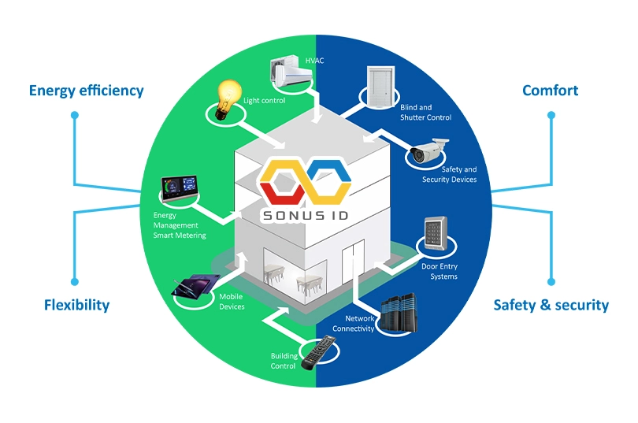

Layanan Pemantauan dan Analitik Energi (EMAS) dan Sistem Otomasi Bangunan (BAS) adalah dua alat penting bagi bisnis dan organisasi yang ingin mengoptimalkan penggunaan energi dan meminimalkan biaya.

EMAS adalah layanan yang memungkinkan bisnis memantau dan menganalisis penggunaan energi mereka secara real-time, memberi mereka wawasan berharga tentang di mana mereka dapat mengurangi dan menghemat uang. Dengan mengumpulkan data dari berbagai sumber, EMAS dapat mengidentifikasi pola dan tren dalam konsumsi energi, membantu bisnis membuat keputusan yang tepat tentang penggunaan energi mereka.

BAS, di sisi lain, adalah jaringan komunikasi infrastruktur yang memungkinkan bisnis mengontrol dan mengotomatiskan berbagai sistem bangunan, seperti pencahayaan dan suhu, untuk menghemat energi dan mengurangi biaya perawatan. Dengan menggunakan sensor dan perangkat pintar lainnya, BAS dapat menyesuaikan sistem bangunan agar sesuai dengan tingkat hunian, kondisi cuaca, dan faktor lainnya, memastikan bahwa energi tidak terbuang sia-sia.

Bersama-sama, EMAS dan BAS dapat merevolusi cara bisnis mengelola penggunaan energi mereka. Dengan EMAS yang menyediakan data dan wawasan real-time, dan BAS yang mengotomatiskan sistem bangunan, bisnis dapat mengoptimalkan penggunaan energi, mengurangi biaya, dan meminimalkan dampak lingkungan mereka.

Jika Anda mencari cara untuk menghemat uang dan mengurangi penggunaan energi, EMAS dan BAS adalah alat yang sangat baik untuk dipertimbangkan. Dengan memberikan wawasan berharga dan mengotomatiskan sistem bangunan, keduanya dapat membantu Anda mencapai tujuan energi Anda dengan cepat dan efisien. Hubungi kami hari ini untuk mempelajari lebih lanjut tentang bagaimana layanan EMAS dan BAS kami dapat menguntungkan bisnis Anda!
