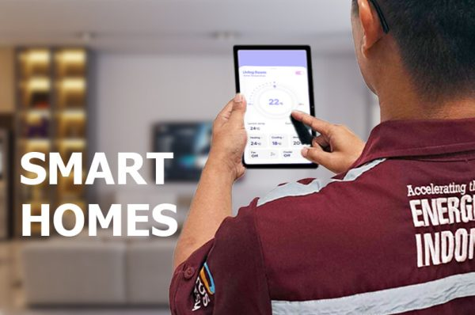

Jika Anda mencari cara untuk mengurangi konsumsi dan biaya listrik rumah tangga Anda, maka Sistem Rumah Pintar kami yang ditenagai oleh energi surya adalah solusinya. Dengan tingkat konsumsi listrik di rumah tangga yang terus meningkat, semakin penting untuk menemukan sumber daya alternatif yang berkelanjutan dan terjangkau.

Dengan memasang pembangkit listrik tenaga surya di atap rumah Anda, Anda dapat sangat mengurangi ketergantungan pada sumber energi tradisional dan secara signifikan memangkas tagihan listrik Anda. Ini bukan hanya solusi yang lebih hemat biaya, tetapi juga ramah lingkungan, karena tenaga surya adalah sumber energi yang terbarukan dan bersih.

Sistem Rumah Pintar kami membawa tenaga surya ke level berikutnya dengan menyediakan fitur manajemen energi canggih yang memungkinkan Anda memantau dan mengoptimalkan konsumsi listrik Anda. Ini berarti Anda dapat mengontrol penggunaan energi Anda dan lebih banyak berhemat pada tagihan Anda.

Ditambah lagi, dengan layanan instalasi dan dukungan ahli kami, Anda dapat yakin bahwa Anda akan mendapatkan hasil maksimal dari pembangkit listrik tenaga surya dan Sistem Rumah Pintar Anda. Jadi mengapa tidak beralih ke energi surya hari ini dan mulai menikmati manfaat dari solusi energi yang lebih berkelanjutan dan hemat biaya? Hubungi kami sekarang untuk mempelajari lebih lanjut.
