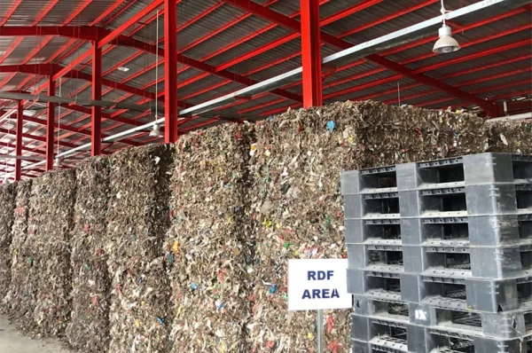

> Mengubah Sampah Menjadi Energi: Kekuatan Refuse-Derived Fuel (RDF)

Tahukah Anda bahwa sampah rumah tangga dapat diubah menjadi sumber energi bernilai tinggi? Inilah Refuse-Derived Fuel (RDF), jenis bahan bakar yang dihasilkan dari pengolahan sampah padat perkotaan (Municipal Solid Waste/MSW) atau sampah rumah tangga. Sampah terlebih dahulu dipilah untuk memisahkan material yang dapat didaur ulang, kemudian diolah menjadi bahan bakar dengan nilai kalor tinggi.

RDF dapat diproduksi melalui berbagai metode, seperti pencacahan, pengeringan, hingga pemadatan menjadi pelet atau briket. Bahan bakar serbaguna ini dapat digunakan sebagai pengganti bahan bakar fosil dalam aplikasi industri, termasuk kiln semen, pembangkit listrik, dan boiler.

RDF menawarkan banyak manfaat. Ia membantu mengurangi volume sampah yang berakhir di tempat pembuangan akhir, sehingga menekan dampak lingkungan dari proses pembuangan sampah. Selain itu, RDF menurunkan emisi gas rumah kaca dengan menggantikan kebutuhan akan bahan bakar fosil, menjadikannya sumber energi yang lebih bersih dan terbarukan. RDF juga dapat membantu negara dan daerah mencapai target energi terbarukan mereka, berkontribusi pada masa depan yang lebih berkelanjutan.

Meskipun penggunaan RDF memiliki tantangan—seperti kebutuhan peralatan khusus untuk menangani dan memproses sampah serta potensi polutan yang dilepaskan saat pembakaran—manfaat dari produksi dan pemanfaatannya tetap signifikan. Dengan memanfaatkan RDF, kita dapat mengubah sampah menjadi sumber energi yang berguna sekaligus mendorong masa depan yang lebih hijau dan berkelanjutan.

## Bergabunglah dalam misi kami mengubah sampah menjadi energi

Hubungi kami sekarang untuk mempelajari lebih lanjut tentang Refuse-Derived Fuel dan bagaimana RDF dapat membawa manfaat bagi bisnis maupun komunitas Anda.
