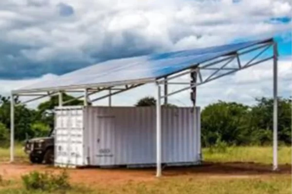

Jika Anda adalah seseorang yang gemar menghabiskan waktu di daerah terpencil—entah itu untuk berkemah, mendaki, atau bahkan hidup mandiri di luar jaringan listrik—Anda pasti tahu betapa pentingnya memiliki sumber daya listrik yang andal. Di sinilah 50100 FG Series berperan. Produk luar biasa ini merupakan pembangkit listrik berbentuk kontainer yang memanfaatkan energi surya untuk menyediakan listrik di mana pun Anda membutuhkannya.

Salah satu keunggulan terbesar dari 50100 FG Series adalah kemudahannya. Berbeda dengan generator tradisional yang memerlukan bahan bakar, sistem ini berjalan menggunakan tenaga matahari. Anda hanya perlu menempatkannya di area yang cukup mendapatkan sinar matahari, dan biarkan ia bekerja. Penggunaannya sangat simpel dan hampir tidak memerlukan perawatan.

Keunggulan lainnya adalah portabilitasnya. Kontainer ini ringkas dan mudah dipindahkan, sehingga Anda dapat membawanya ke mana pun Anda pergi. Sangat ideal untuk menyuplai listrik ke RV atau kabin di tengah hutan. Anda juga bisa menggunakannya sebagai sumber listrik cadangan di rumah saat terjadi pemadaman.

50100 FG Series juga ramah lingkungan. Produk ini tidak menghasilkan gas berbahaya atau polutan, menjadikannya pilihan tepat bagi mereka yang peduli terhadap keberlanjutan. Selain itu, karena menggunakan energi surya, sumber dayanya dapat diperbarui.

Dari sisi performa, 50100 FG Series tidak mengecewakan. Sistem ini mampu menyediakan daya hingga 50 kWp, cukup untuk menjalankan beberapa peralatan sekaligus. Desain kontainernya pun dibuat tahan terhadap kondisi cuaca ekstrem, sehingga Anda tak perlu khawatir akan kerusakan saat terjadi badai.

Sebagai kesimpulan, pembangkit listrik 50100 FG Series merupakan terobosan dalam solusi daya off-grid. Desain kontainer yang modern dipadukan dengan pemanfaatan energi surya menjadikannya pembangkit listrik ideal untuk wilayah terpencil, baik untuk kebutuhan hunian maupun komersial. Produk ini bukan hanya ramah lingkungan, tetapi juga sangat efisien—sebuah investasi cerdas bagi siapa pun yang membutuhkan solusi daya yang dapat diandalkan.

Jadi, jika Anda sedang mencari solusi listrik off-grid atau sekadar ingin mengetahui teknologinya, 50100 FG Series sangat layak dipertimbangkan. Ini adalah cara yang andal, ramah lingkungan, dan hemat biaya untuk menghasilkan listrik di area yang tidak memiliki akses jaringan. Cobalah, dan Anda tidak akan kecewa!
