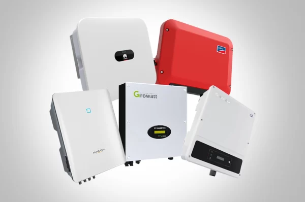

Sonus menghadirkan produk unggulan melalui Off-Grid Inverter untuk Sistem Panel Surya. Teknologi inovatif ini memungkinkan pelanggan memiliki sumber energi berkelanjutan yang tidak bergantung pada jaringan listrik konvensional. Off-grid inverter tersebut dirancang dengan fitur-fitur canggih untuk memaksimalkan efisiensi dan keandalan energi, sehingga mampu menyediakan suplai daya yang stabil dan tidak terputus. Produk ini juga dilengkapi fitur keselamatan yang melindungi sistem dari beban berlebih serta gangguan listrik lainnya.

Sonus memiliki komitmen kuat terhadap kualitas dan kepuasan pelanggan, yang tercermin pada kualitas tinggi off-grid inverter mereka. Produk ini diproduksi menggunakan teknologi mutakhir, dan perusahaan menerapkan pengawasan ketat terhadap kualitas bahan baku serta proses produksi untuk memastikan hasil terbaik.

Off-grid inverter ini mudah dipasang dan dioperasikan, menjadikannya pilihan ideal bagi pelanggan residensial maupun komersial. Inverter ini dapat dihubungkan dengan berbagai jenis panel surya dan baterai, memberikan fleksibilitas untuk merancang solusi energi yang dapat disesuaikan dengan kebutuhan spesifik.

Secara keseluruhan, Off-Grid Inverter dari Sonus merupakan produk unggul yang memberikan solusi energi yang andal, berkelanjutan, dan hemat biaya. Teknologi inovatif ini akan membantu pelanggan mengurangi ketergantungan pada jaringan listrik tradisional serta bergerak menuju masa depan yang lebih hijau.
