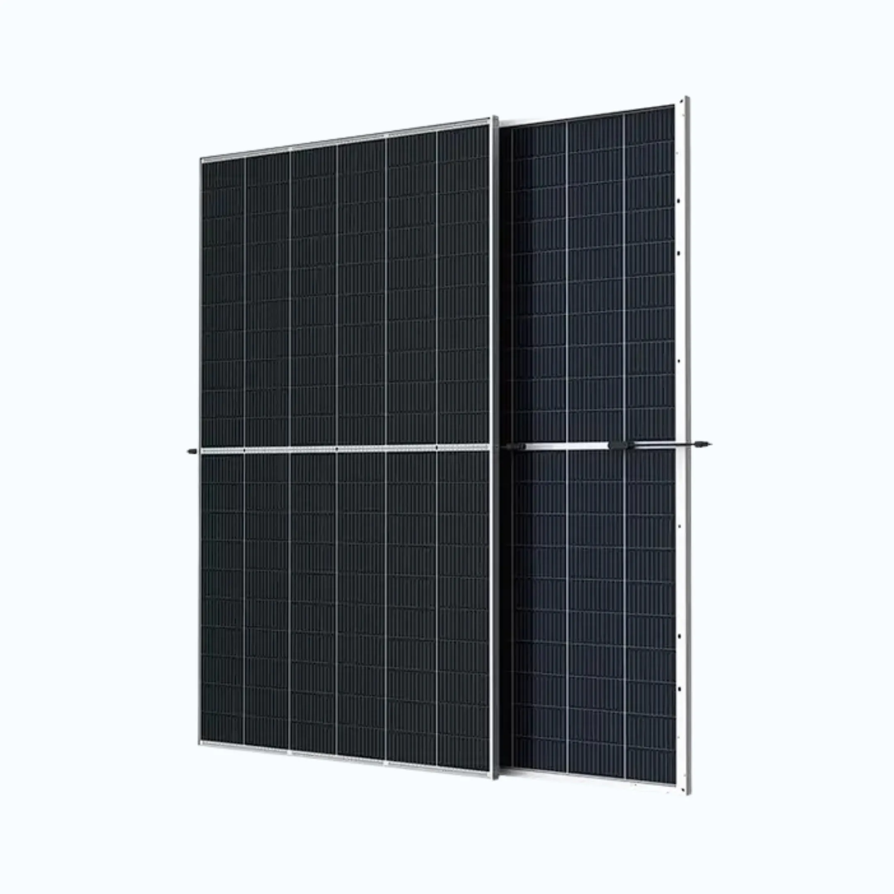

Sistem Panel Surya adalah solusi inovatif dan efektif untuk menghasilkan listrik dengan memanfaatkan energi matahari. Panel surya merupakan komponen utama dalam sistem ini, yang berfungsi menangkap cahaya matahari dan mengubahnya menjadi listrik. SonusID menyediakan Panel Surya berkualitas tinggi yang dibuat untuk tahan lama dan menghasilkan daya maksimal. Panel surya tersebut dirancang agar mampu bertahan dalam kondisi cuaca ekstrem serta tetap bekerja optimal bahkan pada lingkungan dengan cahaya rendah.

Selain memproduksi Panel Surya sendiri, SonusID juga mengimpor Panel Surya berkualitas tinggi dari pemasok terpercaya. Hal ini memastikan tersedianya berbagai pilihan produk dan memungkinkan pelanggan mendapatkan solusi terbaik sesuai kebutuhan spesifik mereka.

Sistem Panel Surya merupakan cara yang hemat biaya dan ramah lingkungan untuk menghasilkan listrik. Teknologi ini menjadi solusi berkelanjutan untuk mengurangi ketergantungan pada bahan bakar fosil sekaligus menurunkan jejak karbon. Sistem Panel Surya dari SonusID mudah dipasang, dirawat, dan dioperasikan, sehingga cocok untuk penggunaan rumah tangga maupun komersial.

Secara keseluruhan, Sistem Panel Surya dan produk Panel Surya dari SonusID memiliki kualitas tinggi dan menawarkan alternatif yang sangat baik dibandingkan sumber listrik tradisional. Baik untuk mengurangi biaya listrik, menurunkan emisi karbon, maupun meningkatkan kemandirian energi, Sistem Panel Surya dan Panel Surya dari SonusID adalah pilihan yang tepat.
