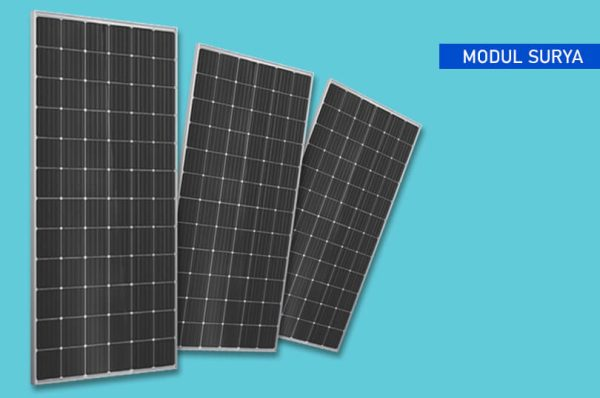

Panel surya kini semakin populer sebagai sumber energi alternatif, dan Panel TKDN dari SONUS menawarkan solusi yang andal serta berkualitas tinggi bagi siapa pun yang ingin beralih ke energi terbarukan. Dengan sel surya berkualitas terbaik, teknologi manufaktur mutakhir, dan prosedur kontrol kualitas yang ketat, Anda dapat yakin bahwa panel-panel ini akan bekerja secara optimal selama bertahun-tahun.

Selain kualitasnya yang luar biasa, Panel TKDN ini juga memiliki nilai TKDN sebesar 43,50%, sehingga menjadi pilihan cerdas bagi bisnis yang ingin memenuhi persyaratan kandungan lokal. Semua produk SONUS terdaftar untuk memudahkan pelacakan, dan panelnya dijamin hanya mengalami penurunan performa tidak lebih dari 1% per tahun, memastikan kemampuan produksi energi bersih tetap efisien dalam jangka panjang.

Kaca anti-reflektif membantu meningkatkan penyerapan cahaya sehingga efisiensi menjadi maksimal, dan garansi resmi produk mencakup garansi usia teknis selama 20 tahun dengan degradasi output maksimum sebesar 20%. Jika Anda mencari sistem panel surya berkualitas tinggi, Panel TKDN dari SONUS adalah pilihan yang tepat.
