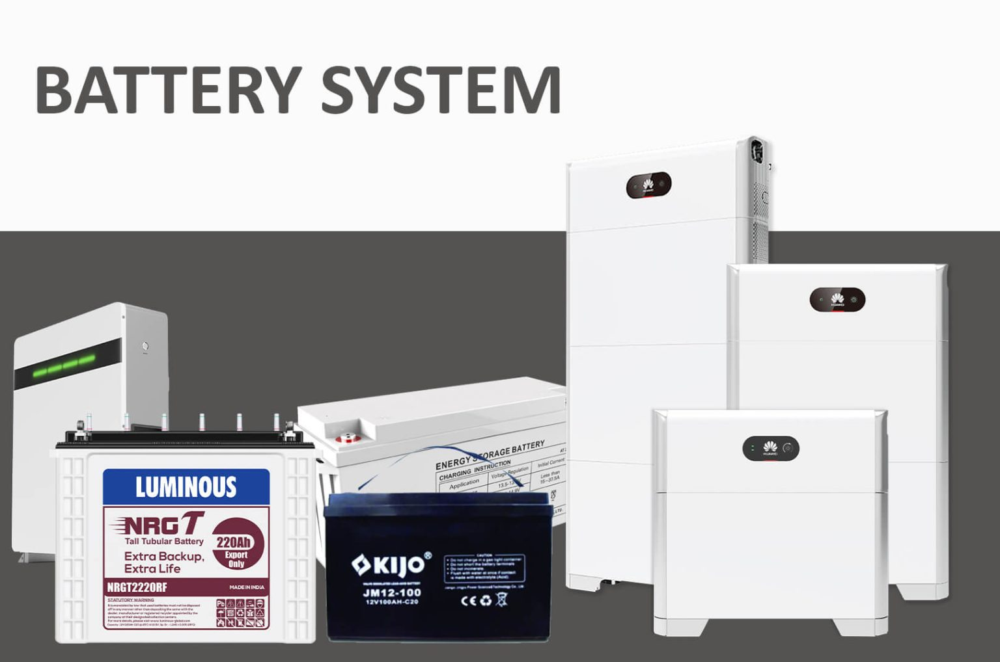

SONUS menyediakan rangkaian lengkap sistem panel surya dan sistem baterai yang dirancang untuk memberikan solusi yang andal dan hemat biaya bagi kebutuhan residensial, komersial, maupun industri.

Sistem Panel Surya terdiri dari panel-panel surya berkualitas tinggi yang menghasilkan listrik dari energi matahari. SONUS menawarkan beragam panel surya yang efisien dan tahan lama, dengan tingkat konversi yang tinggi untuk mengubah lebih banyak cahaya matahari menjadi listrik yang dapat digunakan. Panel-panel ini tersedia dalam berbagai ukuran dan kapasitas watt untuk memenuhi kebutuhan energi spesifik dari setiap aplikasi. Selain itu, panel surya dirancang untuk tahan terhadap kondisi cuaca ekstrem serta resisten terhadap korosi dan kerusakan.

Sistem Panel Surya juga dilengkapi berbagai sistem mounting yang memudahkan proses instalasi dan perawatan panel. Sistem mounting ini tersedia dalam berbagai desain dan material, termasuk baja dan aluminium, untuk menyesuaikan kebutuhan pemasangan yang berbeda. Sistem ini dirancang untuk memastikan orientasi dan sudut panel yang optimal demi menghasilkan energi maksimal.

Sistem Baterai merupakan komponen penting dalam setiap sistem energi surya, karena berfungsi menyimpan energi yang dihasilkan panel untuk digunakan ketika matahari tidak bersinar. SONUS menyediakan berbagai sistem baterai yang andal dan efisien, memiliki densitas energi tinggi serta umur pakai yang panjang. Sistem baterai ini tersedia dalam berbagai ukuran dan konfigurasi untuk memenuhi kebutuhan energi spesifik pada berbagai skenario penggunaan.

Sistem baterai dari SONUS dirancang agar kompatibel dengan sistem panel surya, sehingga memastikan performa optimal dan efisiensi energi yang maksimal. Sistem baterai ini juga dilengkapi fitur canggih seperti intelligent battery management system yang memantau kesehatan baterai serta mengoptimalkan siklus pengisian dan pengosongan untuk memperpanjang umur baterai.

Secara keseluruhan, Sistem Panel Surya dan Sistem Baterai dari SONUS memberikan solusi lengkap dan andal untuk menghasilkan serta menyimpan energi matahari. Kedua sistem ini dirancang agar mudah dipasang, dioperasikan, dan dirawat, sehingga menawarkan solusi jangka panjang yang efisien dan hemat biaya untuk berbagai kebutuhan aplikasi.
