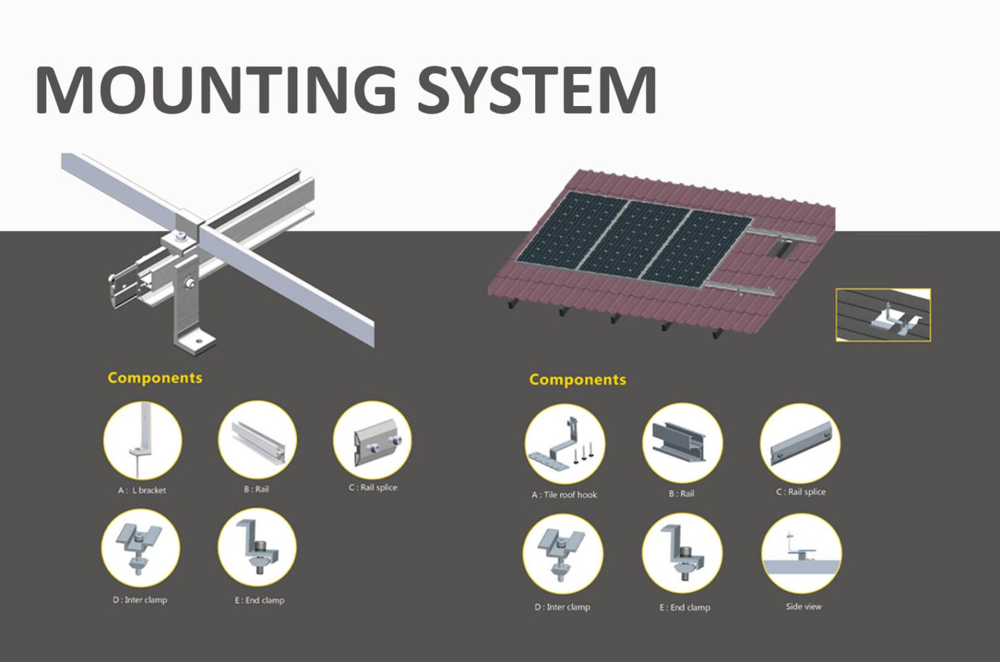

Sistem pemasangan panel surya berbahan baja dari SONUS merupakan solusi yang sangat ideal untuk berbagai proyek fotovoltaik di area tanah bebas. Penggunaan baja MAC berkualitas tinggi atau baja karbon sebagai material utama memastikan stabilitas dan efisiensi biaya dalam desain sistem—dua hal penting dalam setiap proyek. Struktur baja yang kokoh memungkinkan bentang yang lebih panjang antar pondasi, sehingga jumlah penyangga yang dibutuhkan lebih sedikit dan proses instalasi menjadi lebih cepat serta efisien.

Salah satu keunggulan terbesar dari sistem pemasangan ini adalah kompatibilitasnya dengan berbagai kondisi tanah, berkat fleksibilitas untuk menggunakan ground screw maupun pondasi beton. Hal ini memungkinkan sistem untuk beradaptasi dengan kondisi lahan apa pun, baik miring maupun datar, sekaligus mengurangi biaya modifikasi lokasi.

Kesimpulannya, sistem pemasangan panel surya berbahan baja dari SONUS menawarkan solusi yang kokoh, andal, dan hemat biaya untuk berbagai proyek PV surya. Kemampuannya beradaptasi dengan beragam kondisi tanah menjadikannya pilihan cerdas untuk instalasi di lokasi mana pun.
