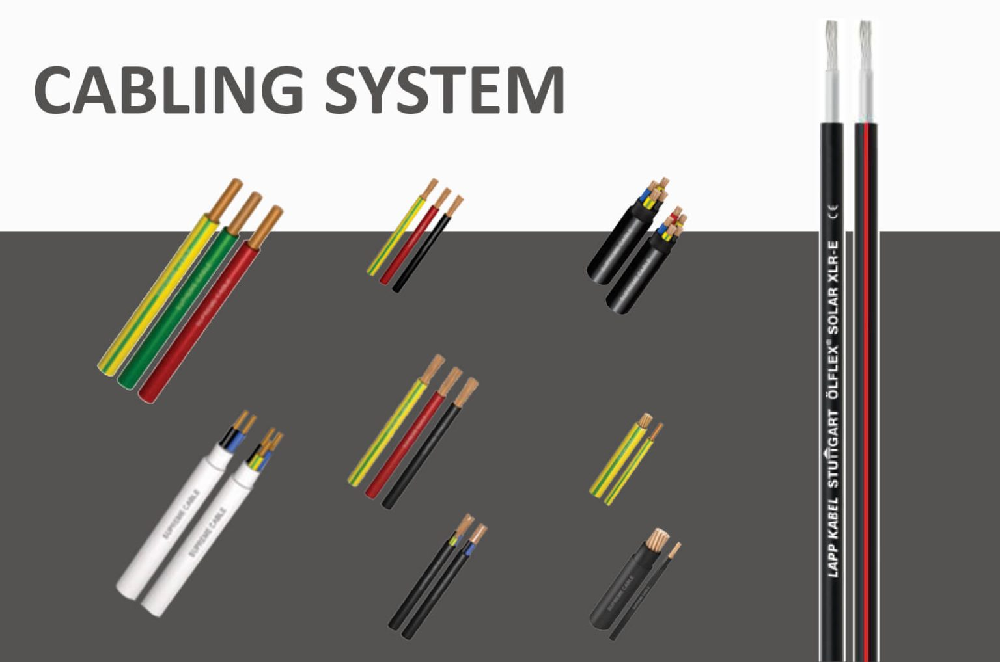

Sistem kabel yang efisien dan andal untuk mengalirkan daya ke sistem panel surya Anda dengan mudah. Konduktor tembaga single-core dan multi-core berlapis PVC kami dirancang untuk instalasi permanen di berbagai area kering maupun area terbuka. Tersedia dalam tipe bundar maupun pipih — pastikan sistem Anda berjalan dengan optimal mulai hari ini
